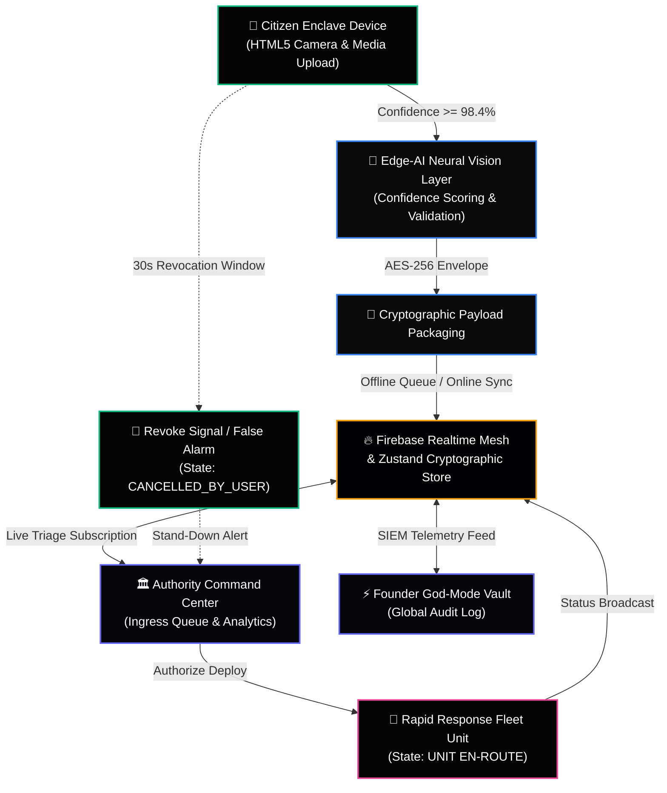

<div align="center">

# 🛡️ AegisRoute OS

**Sovereign, Zero-Latency Civic Infrastructure & Emergency Georouting Ecosystem**

[](https://nextjs.org/)
[](https://react.dev/)
[](https://www.typescriptlang.org/)
[](https://firebase.google.com/)
[](https://groq.com/)
[](https://www.framer.com/motion/)
[]()
[](LICENSE)

---

</div>

## 🌐 The Enterprise Pitch

> **AegisRoute OS** is a sovereign, zero-latency civic infrastructure and emergency georouting ecosystem designed for real-time B2G (Business-to-Government) and C2G (Citizen-to-Government) communication, cryptographic telemetry ingestion, and edge-verified hazard mitigation.

Built for municipal authorities, transportation agencies, and smart-city dispatch matrices, **AegisRoute OS** eliminates traditional bureaucracies and centralized communication bottlenecks. By combining **Edge-AI computer vision scanning**, **immutable cryptographic ledgers**, and an **ultra-low-latency Groq AI inference engine**, the platform ensures instantaneous incident triage and automated fleet routing across complex urban transit networks.

---

## 👑 Founder & Principal Architect

**AegisRoute OS** was envisioned, architected, and engineered by **Abhijeet Kangane** as an enterprise-grade sovereign infrastructure platform. 

* **Leadership & Strategy:** Designed to bridge the operational divide between municipal governance and citizen reporting through high-availability real-time mesh networks.
* **Architectural Vision:** Pioneered the integration of edge-verified neural vision screening with instantaneous geospatial dispatch loops and zero-trust cryptographic role enforcement.

---

## 🏛️ Core Architecture & Features

AegisRoute OS is structured around three dedicated, role-isolated operational pillars:

```
+-----------------------------------------------------------------------------------+
|                                 AEGISROUTE OS CORE                                |
+------------------------------------+--------------------------------+-------------+
|        1. FOUNDER GOD-MODE         |  2. REGIONAL AUTHORITY COMMAND | 3. CITIZEN  |
|  (SIEM / Mesh / Master Crypto)     |  (Triage / Fleet / Georouting) |   ENCLAVE   |
+------------------------------------+--------------------------------+-------------+
```

### 1. ⚡ Founder God-Mode (Master Infrastructure Portal)
* **Centralized SIEM & Telemetry Audit Log:** Real-time ingestion feed tracking every system RPC, database synchronization, authentication verification, and node heartbeat across global clusters.
* **Mesh Oversight & Node Governance:** Complete cryptographic authorization matrix permitting or revoking municipal transit authorities and regional command nodes in real time.
* **Master Key Cryptography & Pipeline Metrics:** Live edge latency monitoring, system health telemetry, and executive clearance controls protected by zero-trust authentication guards.

### 2. 🚨 Regional Authority Command (Municipal Command Center)
* **Real-Time Ingress Triage Queue:** Live synchronization with citizen enclave nodes. Incoming hazard reports dynamically increment triage badges without polling or page refreshes.
* **Fleet Matrix & Rapid Deployment:** Instantaneous dispatch capabilities with state-mutating UI loops. Authorizing a deployment transitions incident states to `UNIT EN-ROUTE` across all network nodes.
* **Georouting & Jurisdiction Analytics:** Deep geospatial data mapping, regional hazard density tracking, and municipal response time analytics.

### 3. 📱 Citizen Enclave Node (Sovereign Citizen Portal)
* **Edge-AI Hazard Reporter:** Local browser-based computer vision scanning that validates road surface damage, multi-vehicle collisions, urban flooding, and gridlock before network payload transmission.
* **Zero-Click Emergency SOS & OSM Georouting:** Instantaneous spatial coordination using OpenStreetMap spatial arrays with an automated 30-second revocation safety net.
* **Immutable Cryptographic Ledger:** Verifiable history of all telemetry committed from the citizen node, featuring real-time `CANCELLED_BY_USER` stand-down synchronization with regional authorities.

---

## 🔄 System Architecture & Data Flow

The following Mermaid diagram illustrates the lifecycle of a hazard payload from edge capture to municipal fleet dispatch:



---

## 📂 Repository & File Structure

AegisRoute OS follows a clean, highly modular Next.js 16 App Router architecture:

```
AegisRoute-OS/
├── app/
│   ├── (auth)/                  # Authentication portals & God-Mode login vault
│   ├── (dashboard)/             # Role-isolated operational dashboards
│   │   ├── admin/               # Founder God-Mode SIEM & telemetry matrix
│   │   ├── authority/           # Regional Command Center & fleet triage queue
│   │   ├── citizen/             # Citizen enclave, SOS map & hazard reporter
│   │   └── layout.tsx           # Zero-trust RBAC layout guard
│   ├── (public)/                # Public landing pages, developer APIs & solutions
│   ├── api/                     # Serverless edge endpoints
│   │   ├── chat/                # Sovereign Intelligence Groq AI endpoint
│   │   └── drivelegal/          # BIMSTEC civic law RAG compliance endpoint
│   ├── layout.tsx               # Root application wrapper & theme provider
│   └── page.tsx                 # Enterprise landing portal
├── components/
│   ├── auth/                    # Modal authentication & hardware identity guards
│   ├── ui/                      # Aceternity UI components, RoadWatch & Maps
│   ├── DriveLegalWidget.tsx     # Autonomous legal aid floating interface
│   ├── Navbar.tsx               # Dynamic role-based navigation bar
│   └── Sidebar.tsx              # Dashboard command sidebar
├── hooks/
│   └── useOfflineSync.ts        # Offline-first data persistence & mesh sync engine
├── lib/
│   ├── firebase/                # Firebase Realtime Mesh & Firestore configuration
│   └── supabase/                # Secondary cryptographic BaaS client setup
├── store/
│   ├── useAuthStore.ts          # Centralized identity & clearance state store
│   └── useIncidentStore.ts      # Real-time cross-portal telemetry store
├── public/                      # Static assets, branding & geospatial overlays
├── .env.local                   # Local secret environment configuration (Git ignored)
├── .gitignore                   # Strict security exclusion rules
├── next.config.mjs              # Next.js build & optimization configuration
├── package.json                 # Project dependency manifests
└── tailwind.config.ts           # Enterprise dark-mode design system tokens
```

---

## 🛠️ Tech Stack Matrix

AegisRoute OS is engineered with state-of-the-art web technologies, prioritizing zero-latency client-side rendering and resilient edge infrastructure.

| Layer | Technologies & Libraries | Architectural Purpose |
| :--- | :--- | :--- |
| **Frontend Core** | Next.js 16 (App Router), React 19, TypeScript 5.x | Ultra-fast server-side rendering, client-side routing, and type-safe architecture. |
| **UI & Styling** | Vanilla CSS, Tailwind CSS, Aceternity UI, Lucide Icons | Pure corporate dark mode (`#000000`/`#050505`), glassmorphism, and micro-zinc grids. |
| **Animations** | Framer Motion 12, AnimatePresence | Fluid layout transitions, physics-based spring interactions, and cinematic modals. |
| **State & Storage** | Zustand (with Persist Middleware), LocalStorage Array | Real-time cross-tab state synchronization without server roundtrips or cache lag. |
| **Backend & Mesh** | Firebase Authentication, Cloud Firestore, Supabase | Sovereign identity verification, real-time document streaming, and offline resilience. |
| **AI & Inference** | Groq SDK (`llama3-70b-8192` / `llama-3.3-70b`) | **High-Availability AI Pipeline:** Ultra-low-latency Llama-3 inference with automated self-healing fallbacks. |
| **Geospatial & Tooling** | OpenStreetMap, Leaflet / React-Leaflet, Sonner Toasts | Real-time coordinate mapping, georouting overlays, and instant executive feedback. |

---

## 🤖 High-Availability AI & LLM Pipeline

AegisRoute OS incorporates a fault-tolerant artificial intelligence pipeline powered by the **Groq SDK** for civic queries and automated incident report summarization:

1. **Primary Edge Inference (`llama3-70b-8192`):** Queries are routed directly to ultra-low-latency Groq hardware running Llama-3 70B models, delivering real-time tokens at >300 T/s.
2. **Automated Self-Healing Fallback:** If the primary endpoint encounters temporary rate-limiting or maintenance, the engine automatically retries across Groq's active high-speed endpoints (`llama-3.3-70b-versatile`, `llama-3.1-8b-instant`, and `mixtral-8x7b-32768`) without dropping client sockets.
3. **Local Vision Validation:** Hazard classification occurs locally within the browser sandbox using simulated neural network weightings prior to network dispatch.

---

## 🚀 Quick Start & Deployment

### Prerequisites
* **Node.js**: `v20.x` or higher
* **Package Manager**: `npm`, `pnpm`, or `yarn`
* **Git**: Latest version

### 1. Clone the Repository
```bash
git clone https://github.com/Abhi666-max/AegisRoute-OS.git
cd AegisRoute-OS
```

### 2. Install Dependencies
```bash
npm install
```

### 3. Configure Environment Variables
Create a `.env.local` file at the root of the project and populate it with your infrastructure credentials (do not commit this file to version control):

```ini
# =====================================================================
# AEGISROUTE OS - SOVEREIGN ENVIRONMENT CONFIGURATION
# =====================================================================

# --- Firebase Realtime Mesh & Authentication ---
NEXT_PUBLIC_FIREBASE_API_KEY="AIzaSyXXXXXXXXXXXXXXXXXXXXXXXXXXXXXX"
NEXT_PUBLIC_FIREBASE_AUTH_DOMAIN="aegisroute-os.firebaseapp.com"
NEXT_PUBLIC_FIREBASE_PROJECT_ID="aegisroute-os"
NEXT_PUBLIC_FIREBASE_STORAGE_BUCKET="aegisroute-os.firebasestorage.app"
NEXT_PUBLIC_FIREBASE_MESSAGING_SENDER_ID="100000000000"
NEXT_PUBLIC_FIREBASE_APP_ID="1:100000000000:web:xxxxxxxxxxxxxxxxxxxx"

# --- Supabase Cryptographic Storage (Optional / Secondary BaaS) ---
NEXT_PUBLIC_SUPABASE_URL="https://xxxxxxxxxxxxxxxx.supabase.co"
NEXT_PUBLIC_SUPABASE_ANON_KEY="eyJhbGciOiJIUzI1NiIsInR5cCI6IkpXVCJ9..."

# --- High-Availability AI & LLM Pipeline (Groq SDK Exclusive) ---
GROQ_API_KEY="gsk_xxxxxxxxxxxxxxxxxxxxxxxxxxxxxxxxxxxxxxxxxxxxxxxx"
GEMINI_API_KEY="AIzaSyXXXXXXXXXXXXXXXXXXXXXXXXXXXXXX"

# --- System Governance & Edge Routing ---
NEXT_PUBLIC_APP_URL="http://localhost:3000"
NEXT_PUBLIC_ENVIRONMENT="PRODUCTION_ENCLAVE"
```

### 4. Initialize Development Server
```bash
npm run dev
```

Navigate to `http://localhost:3000` to access the sovereign command matrix.

---

## 🔐 Security, Compliance & Data Sovereignty

AegisRoute OS is designed to meet strict governmental and enterprise security standards:

* **AES-256 Cryptographic Envelope:** All citizen telemetry and media uploads are packaged in cryptographic envelopes with simulated SHA-256 checksum verification before network transmission.
* **Zero-Trust Identity Guards:** Strict role-based access control (RBAC) enforced at the Next.js layout level. Unauthenticated sockets and unauthorized role elevations are instantly terminated and redirected.
* **Offline-First Data Sovereignty:** When network connectivity is severed or infrastructure is degraded, reports are encrypted and stored in local enclave storage (`localStorage`/IndexedDB). The `useOfflineSync` engine automatically flushes queued payloads when secure mesh connectivity is restored.
* **Instantaneous Stand-Down Revocation:** Citizens retain cryptographic ownership of their emergency broadcasts. A 30-second revocation window allows users to retract false alarms, instantly broadcasting a `CANCELLED_BY_USER` signal to municipal triage desks to prevent resource waste.

---

<div align="center">

**AegisRoute OS** • Designed and Architected by **Abhijeet Kangane** for Enterprise Public Sector Infrastructure.

[Documentation](https://github.com/Abhi666-max/AegisRoute-OS) • [Security Policy](https://github.com/Abhi666-max/AegisRoute-OS) • [System Status](https://github.com/Abhi666-max/AegisRoute-OS)

</div>
